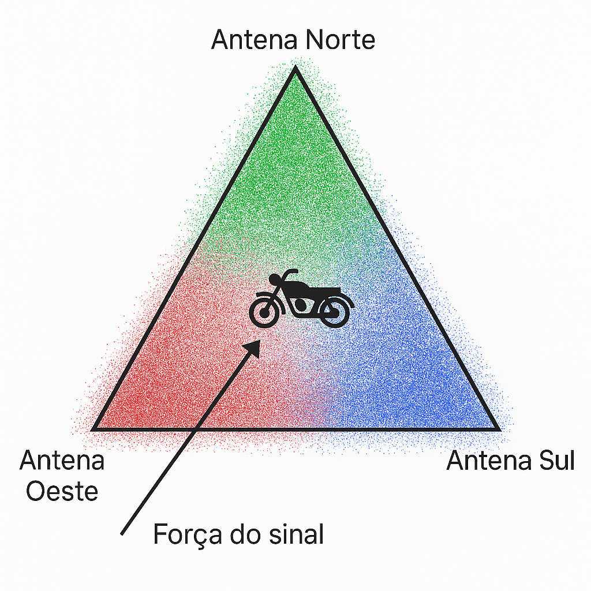
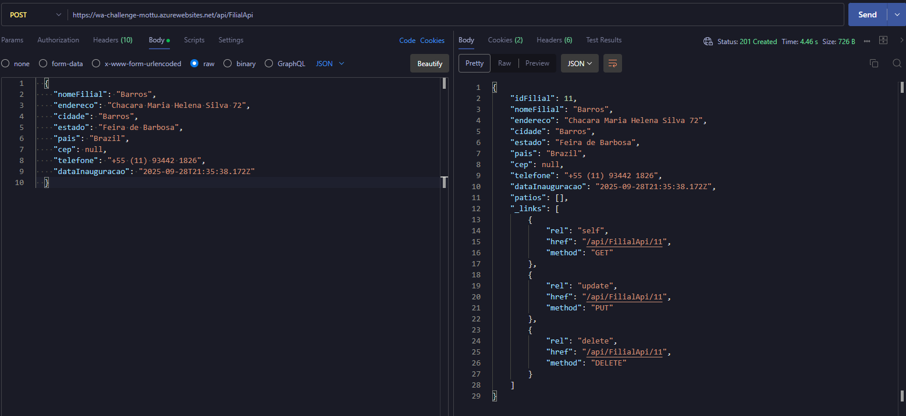
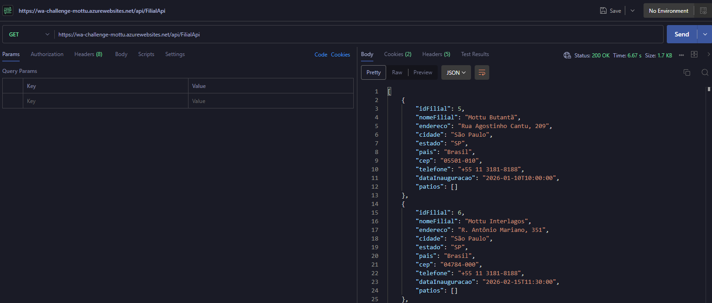
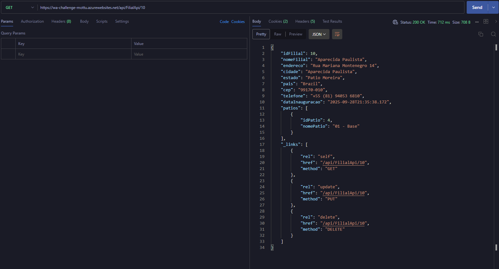
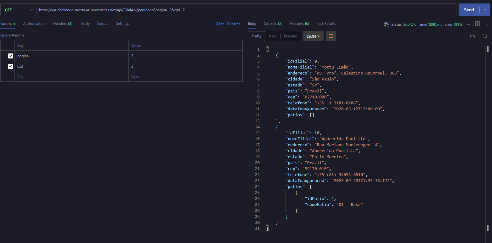
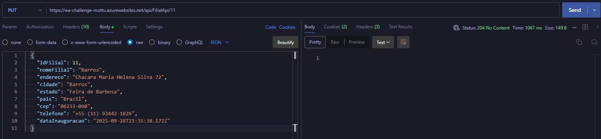
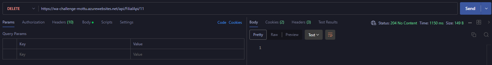

# ADVANCED-BUSINESS-DEVELOPMENT-WITH-.NET

## **👥 Integrantes**

|            NOME             |   RM   |
| :-------------------------: | :----: |
|  Francesco M Di Benedetto   | 557313 |
| Luiz Felipe Campos da Silva | 555591 |
|   Samuel Patrick Yariwake   | 556461 |

## **🎯 Objetivo**

### Rastrear uma moto no patio da MOTTU.

## **💡 Solução**

### Utilizar IOT para rastrear uma moto no patio da MOTTU, triangulando a localização com o uso de WIFI.



A proposta é usar **dispositivos IoT (como o ESP32)** para captar a intensidade de sinal de redes WiFi no entorno, mesmo sem conexão ativa, e assim **triangular a localização da moto** de forma estimada.

Com um custo aproximado de **R$ 50,00 por dispositivo**, conseguimos montar um sistema inteligente e acessível para monitoramento interno.

## **🧱 Arquitetura**

.png)

--- 

.png)

- O uso do **ESP32** permite a captação de sinais WiFi.
- Os dados são enviados para uma **API construída em .NET**, integrando com ferramentas da Azure.
- O uso da **Azure App Services** permite escalar a aplicação facilmente e garante alta disponibilidade.
- A divisão entre **CosmosDB** (para dados não estruturados) e **MySQL** (dados relacionais) facilita o gerenciamento.
- O uso de **Application Insights** permite monitorar a performance da API em tempo real.

### _Fluxo_

1. IOT envia dado de `intensidade - Endereco MAC`.
2. API em DOTNET envia para o banco de dados NoSQL.
3. Desenvolvimento python lê os documentos e gera uma coordenada de localização no patio
4. Registro da posição no banco MySQL
5. Envio da posição para o front por meio da API DOTNET

## **Desenvolvimento**

### _Entidades_

Podemos definir 7 entidade prioritárias:

1. Filial
2. Patio
3. Wifi
4. Moto
5. IOT
6. Registro Sinal
7. Posição da moto

Para se ter uma triangulação da moto, precisamos de uma `referencia` de localização, sendo necessário registro da filial, os patios que ela possui e onde estão localizados os receptores de WiFi.

Cada Moto terá um IOT que enviará os dados de `intensidade - Endereco MAC`.

### _Test_

Utilizamos o xUnit para automatizar testes de lógica dos endpoints.
Para efetuar os testes:
1. Clonar o repositório
2. Abrir o terminal na pasta raiz do projeto

```sh
cd CM-API-MVC.Tests

dotnet test
```

> Caso prefira, pode-se usar a função de gerenciamento de testes disponível na IDE do Visual Studio

### _Endpoints_

| Método |                      Rota                       |            Descrição             |
| :----: | :---------------------------------------------: | :------------------------------: |
|  GET   |               **/api/[entidade]**               |    Retorna todos os registros    |
|  GET   | **/api/[entidade]/paginado?pagina=[x]&qtd=[y]** |   Retorna registros paginados    |
|  GET   |            **/api/[entidade]/{id}**             | Retorna um único registro por ID |
|  POST  |               **/api/[entidade]**               |      Cria um novo registro       |
|  PUT   |            **/api/[entidade]/{id}**             |  Atualiza um registro existente  |
| DELETE |            **/api/[entidade]/{id}**             |   Remove um registro existente   |

> `Registro Sinal` não tem PUT, já que não se pode adulterar um registro.

_🎥 Video de exemplos de uso:_ [Clique aqui](https://www.youtube.com/watch?v=ggy3IovgXw0)

---








---

## **🔗 Links adicionais**

- _IOT:_ [Link do video](https://www.youtube.com/watch?v=x1tqTbfKPlQ)

- _DEVOPS:_ [Link do video](https://www.youtube.com/watch?v=x_9JstYHxVY)

- _Aplicação:_ [WebApp](https://wa-challenge-mottu.azurewebsites.net)
